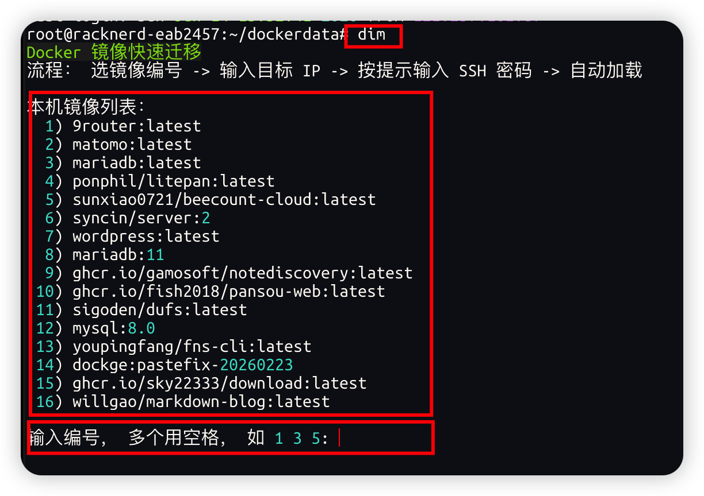

# docker-images-move

一个适合 Linux 命令行操作的 Docker 镜像迁移工具。

当目标服务器无法直接 `docker pull` 镜像时，可以用它在服务器之间迁移 Docker 镜像：自动 `docker save`、传输镜像包、并在目标服务器执行 `docker load`。



## 适用场景

- 目标服务器网络受限，无法拉取 Docker Hub / GHCR / 私有仓库镜像
- 你有一台 A 服务器能拉镜像，另一台 B 服务器不能拉镜像
- 你希望在 Linux 命令行中用更短、更直观的方式迁移镜像
- 想通过编号选择镜像，而不是手动复制完整镜像名

## 功能特点

- 命令行友好：直接输入 `dim`，按提示选编号即可
- 支持本机镜像推送到远端服务器
- 支持在 B 服务器上远程查看 A 服务器镜像，并拉取到 B
- 支持多镜像批量迁移
- 支持 SSH 密码登录，也支持密钥登录
- 使用 SSH 连接复用，避免同一次迁移反复输入密码
- 默认上传到远端 `/mnt`
- 远端镜像包默认保留，方便后续手动处理
- 本地临时包默认自动清理

## 安装

推荐一条命令安装，并创建全局 `dim` 命令：

```bash
mkdir -p /mnt && cd /mnt && git clone https://github.com/youpingfang/docker-images-move.git && cd docker-images-move && chmod +x images.sh && ln -sf "$(pwd)/images.sh" /usr/local/bin/dim
```

之后任意目录都可以直接使用：

```bash
dim
```

如果不想创建全局命令，也可以只克隆项目后直接运行：

```bash
mkdir -p /mnt && cd /mnt && git clone https://github.com/youpingfang/docker-images-move.git && cd docker-images-move && chmod +x images.sh
bash images.sh
```

## 最简单用法

直接输入：

```bash
dim
```

流程：

1. 自动列出本机 Docker 镜像编号
2. 输入要迁移的编号，例如 `1` 或 `1 3 5`
3. 输入目标服务器 IP，例如 `1.2.3.4`
4. 如需密码，按 SSH 提示输入密码
5. 自动打包镜像并上传到目标服务器 `/mnt`
6. 自动在目标服务器执行 `docker load`
7. 远端 `/mnt/*.tar.gz` 默认保留，本地临时包默认删除

## 默认行为说明

- `dim`：查看当前这台 Linux 服务器上的 Docker 镜像，选择编号后推送到目标服务器。
- `dim p`：从另一台源容器服务器拉取镜像到当前服务器；如果不带 IP，会提示你输入源容器服务器 IP。

## 模式一：从当前服务器推送到目标服务器

适合：你正在 A 服务器上，想把 A 的镜像传到 B。

### 向导模式

```bash
dim
```

### 直接指定目标 IP

不知道镜像名时：

```bash
dim m 1.2.3.4
```

脚本会列出本机镜像编号，让你选择。

知道镜像名时：

```bash
dim m 1.2.3.4 nginx:alpine
```

多个镜像：

```bash
dim m 1.2.3.4 nginx:alpine redis:7 mysql:8
```

指定 SSH 端口：

```bash
dim m 1.2.3.4:2222 nginx:alpine
```

指定 SSH 用户：

```bash
dim m admin@1.2.3.4 nginx:alpine
```

## 模式二：在 B 服务器上拉取 A 服务器镜像

适合：你正在 B 服务器上，想远程查看 A 服务器的镜像，然后拉到 B。

```bash
dim p
```

脚本会提示你输入源容器服务器 IP。

也可以直接带上源服务器 IP：

```bash
dim p A服务器IP
```

示例：

```bash
dim p
dim p 1.2.3.4
```

流程：

1. B 通过 SSH 连接 A
2. 列出 A 上的 Docker 镜像编号
3. 输入编号选择镜像
4. A 执行 `docker save`
5. 镜像通过 SSH 流式传回 B
6. B 保存到 `/mnt/docker-images-move`
7. B 执行 `docker load`

指定端口：

```bash
dim p 1.2.3.4:2222
```

指定用户：

```bash
dim p admin@1.2.3.4
```

如果知道 A 上的镜像名，也可以直接写：

```bash
dim p 1.2.3.4 nginx:alpine
```

## 常用短命令

```bash
dim ls              # 编号查看本机镜像
dim s IMAGE         # 保存镜像到本机
dim l FILE          # 加载 tar/tar.gz 镜像包
dim m IP            # 本机镜像迁移到远端服务器
dim p               # 提示输入源服务器 IP，再从远端拉镜像到本机
dim p IP            # 从远端服务器拉镜像到本机
```

## 完整参数模式

### 推送模式

```bash
dim move -H 1.2.3.4 nginx:alpine
```

参数：

```text
-H, --host IP            目标服务器 IP/域名
-u, --user USER          SSH 用户，默认 root
-p, --port PORT          SSH 端口，默认 22
-r, --remote-dir DIR     远端目录，默认 /mnt
-o, --output-dir DIR     本地临时目录，默认 /mnt/docker-images-move
    --no-load            只上传，不在远端 docker load
    --keep-local         保留本地 tar.gz
    --remove-remote      远端加载后删除 tar.gz，默认保留
    --no-compress        不压缩，保存为 .tar
    --ssh-opts OPTS      额外 SSH/SCP 参数
```

### 拉取模式

```bash
dim pull -H 1.2.3.4
```

参数：

```text
-H, --host IP            源服务器 IP/域名
-u, --user USER          SSH 用户，默认 root
-p, --port PORT          SSH 端口，默认 22
-o, --output-dir DIR     本地保存目录，默认 /mnt/docker-images-move
    --no-load            只保存，不在本机 docker load
    --remove-local       本机 docker load 后删除 tar.gz，默认保留
    --ssh-opts OPTS      额外 SSH 参数
```

## 示例

跳过首次 SSH 指纹确认：

```bash
dim move -H 1.2.3.4 nginx:alpine --ssh-opts "-o StrictHostKeyChecking=no"
```

只上传镜像包，不远端加载：

```bash
dim move -H 1.2.3.4 nginx:alpine --no-load
```

远端加载后删除 `/mnt` 下的镜像包：

```bash
dim move -H 1.2.3.4 nginx:alpine --remove-remote
```

从 A 拉镜像到当前服务器，但只保存不加载：

```bash
dim pull -H 1.2.3.4 nginx:alpine --no-load
```

## 目录说明

默认目录：

```text
远端临时目录：/mnt
本地临时目录：/mnt/docker-images-move
```

推送模式下：

- 本地临时包默认删除
- 远端 `/mnt/*.tar.gz` 默认保留

拉取模式下：

- 本地 `/mnt/docker-images-move/*.tar.gz` 默认保留
- 镜像默认会自动 `docker load`

## 环境要求

源服务器和目标服务器建议都有：

- Linux
- Bash
- Docker
- SSH
- gzip

推送模式需要：

- 当前服务器：Docker、ssh、scp、gzip
- 目标服务器：Docker、ssh、gzip

拉取模式需要：

- 当前服务器：Docker、ssh、gzip
- 远端服务器：Docker、gzip

## 常见问题

### 不知道镜像名怎么办？

直接运行：

```bash
dim
```

或：

```bash
dim ls
```

脚本会用编号列出镜像，按数字选择即可。

## License

MIT
